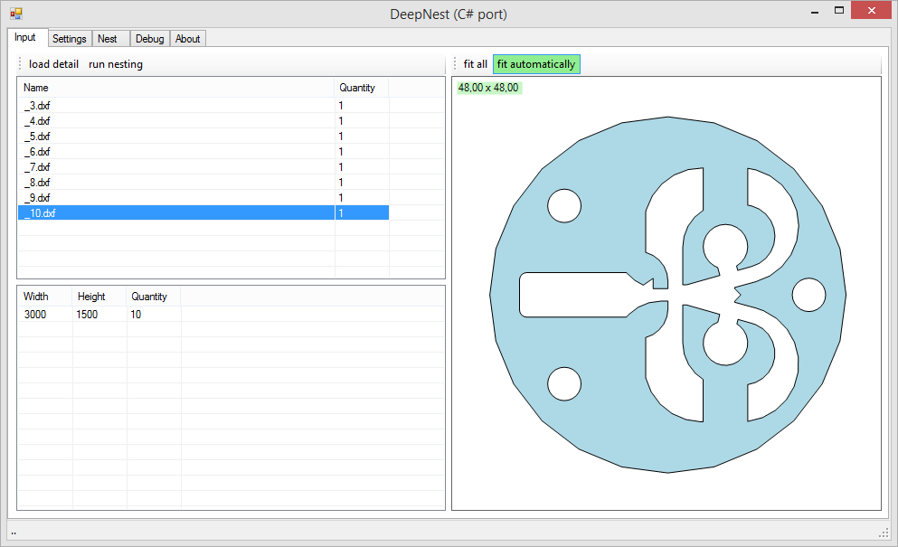

# DeepNestPort
DeepNest C# Port (https://github.com/Jack000/Deepnest)

DXF Import/Export: https://github.com/IxMilia/Dxf

**Project status: WIP**




## Compiling minkowski.dll
1. Replace <boost_1.62_path> with your real BOOST (1.62) path in compile.bat

Example:
```
cl /Ox ..... -I "C:\boost_1_62_0" /LD minkowski.cc
```
2. Run compile.bat using Developer Command Prompt for Visual Studio
3. Copy minkowski.dll to DeepNestPort.exe folder

## Contributors
* https://github.com/Daniel-t-1/DeepNestPort (dxf export)
