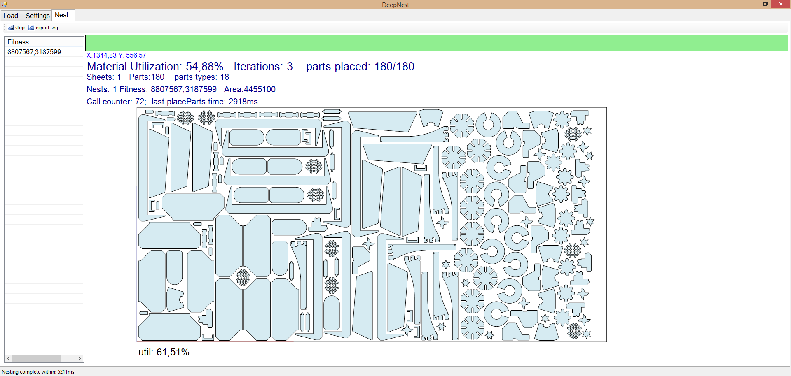

# DeepNestPort
DeepNest C# Port (https://github.com/Jack000/Deepnest)

**Project progress: 80%**

## Compiling minkowski.dll
1. Replace path to boost in compile.bat
2. Run compile.bat using Developer Command Prompt for Visual Studio
3. Copy minkowski.dll to DeepNestPort.exe folder
